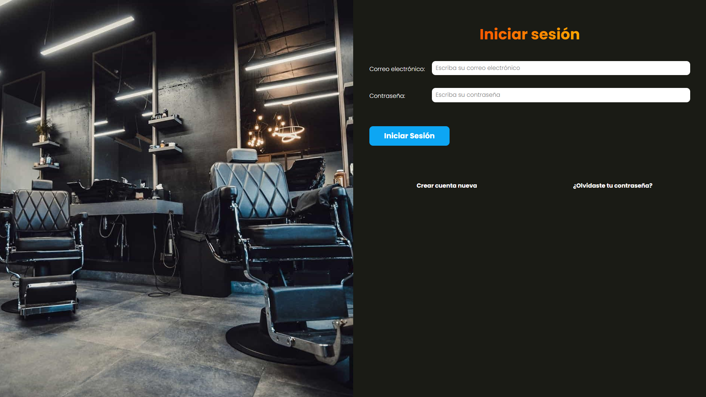

# Salon

Aplicación web para la gestión y reserva de citas en un salón de belleza, desarrollada con PHP y MySQL bajo una arquitectura MVC. Permite a los clientes reservar citas y consultar los servicios disponibles, mientras que los administradores pueden gestionar citas y servicios.

## Tecnologías

- PHP 8
- MySQL
- MySQLi
- JavaScript
- Sass
- Gulp
- PHPMailer
- Composer

## Funcionalidades

- Registro y autenticación de usuarios.
- Confirmación de cuentas mediante correo electrónico.
- Recuperación de contraseña.
- Visualización de servicios disponibles.
- Reserva de citas seleccionando fecha, hora y servicios.
- Validación de fechas y horarios para las citas.
- Consulta y gestión de citas desde el área administrativa.
- Gestión de servicios mediante CRUD.
- Control de acceso para usuarios y administradores.
- Envío de correos electrónicos mediante PHPMailer.
- Manejo de variables de entorno.
- Diseño responsive.

## Conceptos aplicados

- Arquitectura MVC.
- Programación Orientada a Objetos (POO).
- Patrón Active Record.
- Routing.
- Autoloading mediante PSR-4.
- Manejo de sesiones.
- Autenticación y autorización de usuarios.
- Manejo y validación de formularios.
- Consumo de APIs mediante Fetch API.
- Manejo de peticiones HTTP.
- Variables de entorno.
- Envío de correos electrónicos.
- Separación de responsabilidades.
- Consultas a MySQL mediante MySQLi.
- Relaciones entre tablas.
- Manejo de archivos y procesamiento de datos.

## Instalación

### 1. Clonar el repositorio

```bash
git clone https://github.com/devjmmg/salon.git

cd salon
```

### 2. Instalar dependencias de PHP

```bash
composer install
```

### 3. Instalar dependencias de JavaScript

```bash
npm install
```

### 4. Configurar las variables de entorno

Crear un archivo .env en la raíz del proyecto tomando como referencia .env.example.

Configurar las credenciales de la base de datos y del servidor SMTP:

```bash
DB_HOST=
DB_USER=
DB_PASSWORD=
DB_NAME=

EMAIL_HOST=
EMAIL_USERNAME=
EMAIL_PASSWORD=
EMAIL_PORT=

DOMAIN_URL=
```

### 5. Configurar la base de datos

Crear una base de datos MySQL y configurar el nombre de la base de datos en DB_NAME dentro del archivo .env.

El proyecto incluye un dump de la estructura de la base de datos en:

```bash
salon.sql
```

Importar este archivo en la base de datos creada para generar las tablas necesarias para el funcionamiento de la aplicación.

### 6. Ejecutar Gulp

Iniciar Gulp para compilar los archivos Sass y JavaScript:

```bash
npm run dev
```

### 6. Ejecutar el proyecto

En otra terminal, iniciar el servidor de PHP:

```bash
php -S localhost:3000 -t public
```

La aplicación estará disponible en:

```bash
http://localhost:3000
```

## Demo

[Ver aplicación](https://php-salon.onrender.com/)

## Autor

Juan Manuel Martínez García

GitHub: [devjmmg](https://github.com/devjmmg)